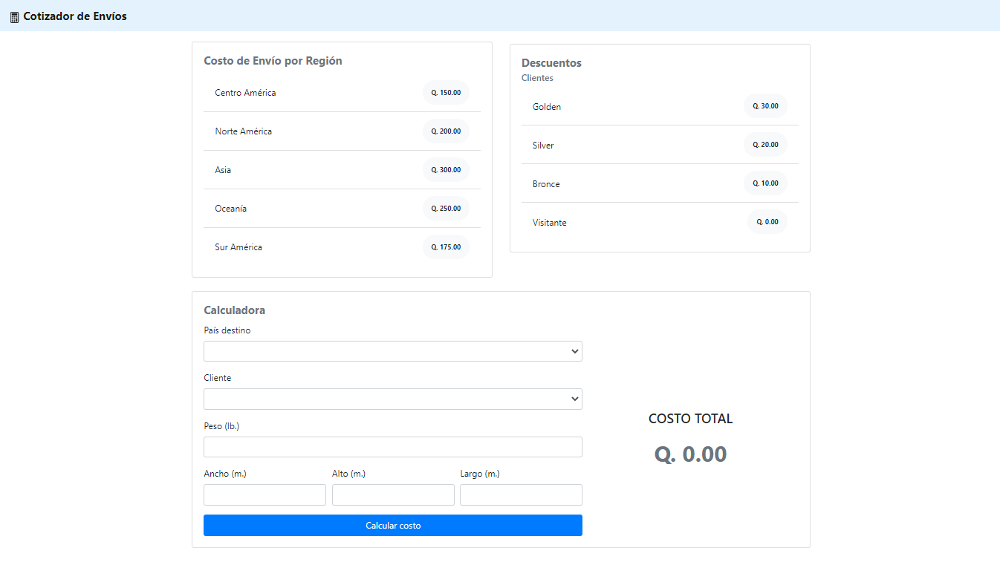
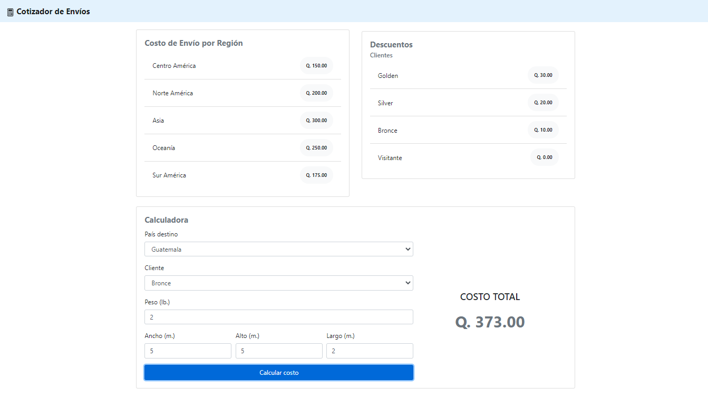

# Cotizador de envíos

Una empresa de envíos está solicitando a un Freelancer el proyecto de un **cotizador de envíos**, el cual consta de:

Una página web, la cual contará con un formulario en donde se solicite los parámetros:

- Peso _(lb.)_
- Ancho _(m.)_
- Alto _(m.)_
- Largo _(m.)_
- País de destino
- Un único país de origen

Las tarifas estarán relacionadas directamente al país de destino y éstas se manejarán **por región**. Ejemplo: Norte América, Asia, Oceanía, África, Suramérica, Centro América, etc.

El core del negocio se centra a que los clientes tendrán un código especial, el cual aplicará a un **descuento** en el total dependiendo del nivel de cliente que sea; si no es cliente y es únicamente visitante, el sistema le devolverá una tarifa estándar.

Los requerimientos con base a software son los siguientes:

- **Rest API con Spring Boot** conectado a una base de datos de **SQL Server**, la cual devolverá las tarifas almacenadas o los descuentos por el cliente.
- **Frontend con Angular JS**; el cotizador deberá consumir los servicios creados basado en la formula:
```(peso*tarifa) + (1.66*alto*largo*ancho) – (descuento cliente*0.5*peso)```

## Comenzando 🚀

### Pre-requisitos 📋

- [Sql Server Express](https://www.microsoft.com/es-es/sql-server/sql-server-downloads)
- [Angular v. 8](https://v8.angular.io/docs)
- [Java v. 11 _Oracle Edition_](https://www.oracle.com/java/technologies/javase-jdk11-downloads.html)

### Configuración 🔧

Como primer paso, ejecuta el archivo [script.sql](script.sql) en Sql Server para generar la base de datos y las tablas que se utilizarán.

Después de ejecutar el script, en el archivo [application.properties](api/src/main/resources/application.properties) debes reemplazar el valor de las propiedades ***username*** y ***password*** con las credenciales de Sql Server para conectarte a la base de datos **QuoteApp**.

```properties
spring.datasource.username=user
spring.datasource.password=password
```

## Resultado [:computer:]






## Demo [:computer:]


---
